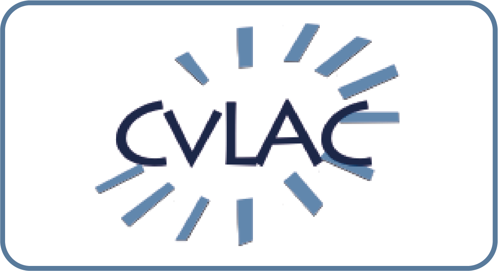

:::: {class='fluid-row'}

::: {class='col-md-9'}
I'm a historian  of economics at Universidad del Valle. My research focuses on the history of macroeconomics and monetary economics, the production and uses of economic knowledge in central banks, and the history of economics in Colombia. I'm part of [GIHPTE](https://sites.google.com/view/gihpte/home) and [COAPTAR](https://socioeconomia.univalle.edu.co/grupo-de-investigacion/conflicto-aprendizaje-y-teoria-de-juegos){target="_blank"}. You can find my [full CV here](Acosta_CV_English.pdf).

You can reach me at juancarlos.acosta@correounivalle.edu.co or <a rel="me" href="https://econtwitter.net/@jcaacostam">@jcaacostam@econtwitter.net</a>
:::

::: {class='col-md-3'}
{widht=10%}

<small>
Credit: [Paul Dudenhefer](https://www.pauldudenhefer.net/){target="_blank"}

[{height=50px}](https://scienti.minciencias.gov.co/cvlac/visualizador/generarCurriculoCv.do?cod_rh=0001637596)
:::

::::
